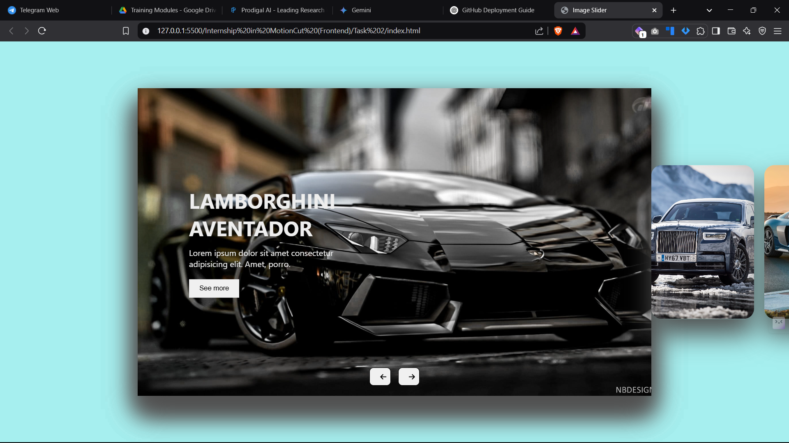

# 🚀 Internship Task 2 - Image Slider 🎨  

## 🌟 About Motioncut  
[Motioncut](https://motioncut.com/) is a **creative digital agency** that specializes in crafting innovative digital solutions. The company focuses on web development, branding, and digital marketing to help businesses grow and establish a strong online presence.  

This **Image Slider** project is a part of **Internship Task 2** at **Motioncut Crafting Futures**. 🏆  

---

## 🔗 Live Demo  
[](https://your-username.github.io/image-slider/)  

---

## 📌 Features  
✅ Smooth sliding animation  
✅ Stylish UI with multiple images  
✅ Previous & Next buttons for navigation  
✅ Responsive Design  

## 📁 Project Structure  
/project-folder <br>
│── index.html # Main HTML file <br>
│── style.css # Stylesheet <br>
│── app.js # JavaScript file <br>
│── images/ # Folder to store images <br>
│── output/ # Folder to store final output image <br>


## 📸 Output Image
Here is the preview:



---

## 🛠️ Technologies Used  
- **HTML5** 🏗️ - Structuring the webpage  
- **CSS3** 🎨 - Styling & Animations  
- **JavaScript** ⚡ - Image slider functionality  

---

## ⚙️ How to Setup Locally  
Follow these steps to run the project on your local machine:  

1️⃣ **Clone the repository**  
```bash
git clone --recursive https://github.com/Pavansai20054/Motion-Cut.git
```

2️⃣ **Open `index.html` in a browser**

Simply double-click the `index.html` file.

## 📜 License  
This project is licensed under the **MIT License**. 📝  
See the [LICENSE](LICENSE.txt) file for more details.  


📬 Contact

**📧 Email:** psai49779@example.com

**🔗 LinkedIn:** https://www.linkedin.com/in/rangdal-pavansai/

**💻 GitHub:** https://github.com/Pavansai20054
